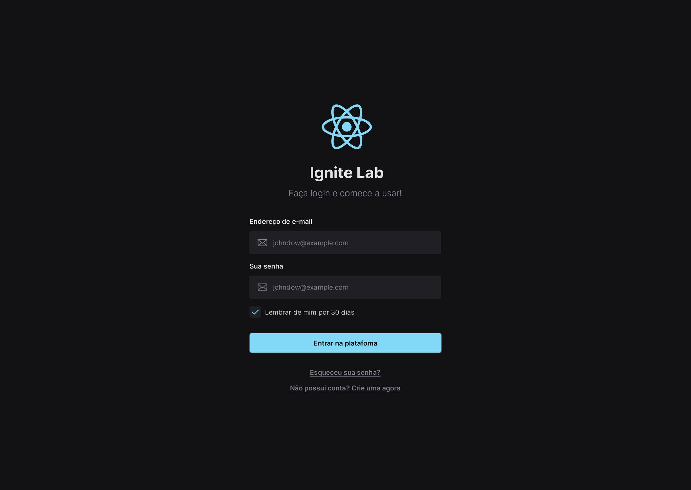

<h1 align="center"> Design System com Storybook </h1>

Projeto que simula design system utilizando o storybook como ferramenta para documentar componentes construídos com React.

  <a href="#-tecnologias">Tecnologias</a>&nbsp;&nbsp;&nbsp;|&nbsp;&nbsp;&nbsp;
  <a href="#-projeto">Projeto</a>&nbsp;&nbsp;&nbsp;|&nbsp;&nbsp;&nbsp;
  <a href="#-layout">Layout</a>&nbsp;&nbsp;&nbsp;|&nbsp;&nbsp;&nbsp;
  <a href="#memo-licença">Licença</a>

  

 

  

## 🚀 Tecnologias

Esse projeto foi desenvolvido com as seguintes tecnologias:

- HTML5, CSS3 e Javascript (ES6+)
- [React](https://reactjs.org/)
- [Typescript](https://www.typescriptlang.org/)
- [Node e Yarn](https://nodejs.org/)
- [React Hot Toast](https://react-hot-toast.com/)
- [Storybook](https://storybook.js.org/)
- [Vite](https://vitejs.dev/)

Escrito e formatado com:
- [ESLint](https://eslint.org/docs/latest/user-guide/configuring/)
- [Prettier](https://prettier.io/)

## 💻 Projeto

Este é um componente simples que simula uma tela de login tendo um padrão de design que foi documentado utilizando o Storybook, neste projeto também temos outras tecnologias como o Typescript e o React Hot Toast para fomentar uma maior prática dos conhecimentos adquiridos, o projeto foi escrito e formatado usando alguns padrões e regras para que se mantenha também uma boa escrita, um código limpo e legível.

## 🔖 Layout

Você pode visualizar o layout do projeto [aqui](https://www.figma.com/file/OZvXxkm6chAaC8NFFwV80L/react-design-system-with-storybook?node-id=0%3A1). É necessário ter conta no [Figma](https://figma.com) para acessá-lo.

## 📝 Licença

Esse projeto está sob a licença MIT.
